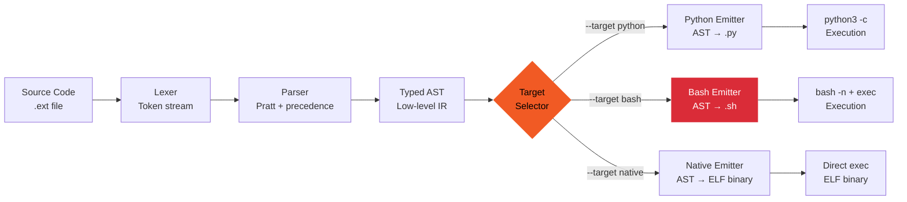
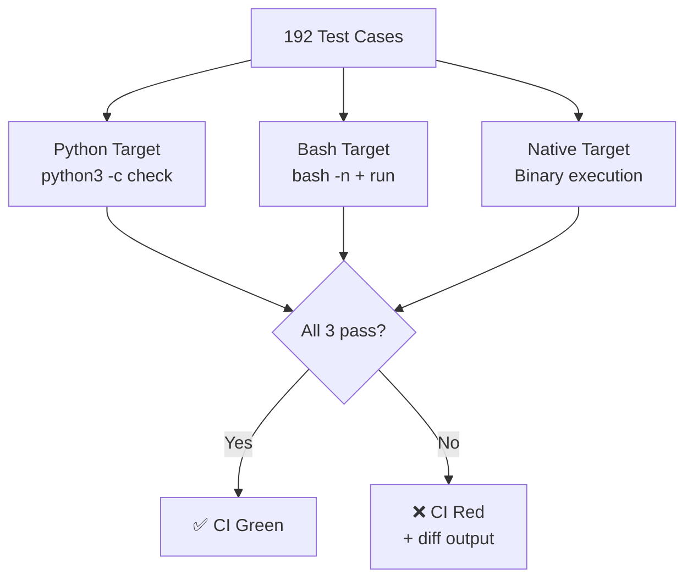

## Architecture

externum is a **triple-target programming language** — same source compiles to Python, Bash, or a native binary. 366 tests, all three targets.

### Compiler Pipeline



### Test Matrix



## Quickstart

### One-liner — Install & compile

```bash
pip install externum && echo 'fn main() { print("hello") }' > hello.ext && externum compile --target python hello.ext && python3 hello.py
```

### One-liner — Build from source

```bash
git clone https://github.com/BartoszOsiej/externum && cd externum && pip install -e ".[dev]" && pytest -q
```

### One-liner — Triple-compile demo

```bash
git clone https://github.com/BartoszOsiej/externum && cd externum && \
  externum compile --target python examples/hello.ext -o hello.py && \
  externum compile --target bash examples/hello.ext -o hello.sh && \
  externum compile --target native examples/hello.ext -o hello && \
  python3 hello.py && bash hello.sh && ./hello
```

### One-liner — Run full test suite

```bash
git clone https://github.com/BartoszOsiej/externum && cd externum && pip install -e ".[dev]" && pytest tests/ -v --tb=short
```

### One-liner — Docker (all three targets)

```bash
docker run --rm -v "$(pwd)":/src -w /src \
  ghcr.io/bartoszosiej/externum:latest \
  bash -c "externum compile --target python hello.ext -o /src/hello.py && externum compile --target bash hello.ext -o /src/hello.sh && externum compile --target native hello.ext -o /src/hello"
```
